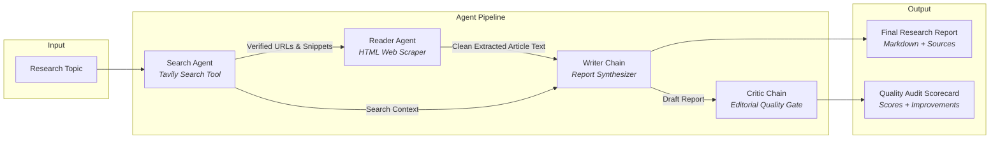

# ResearchMind: Autonomous Multi-Agent AI Research System
https://multi-agent-research-assistant-1-jtam.onrender.com

[](https://www.python.org/)
[](https://www.langchain.com/)
[](https://streamlit.io/)
[](https://groq.com/)
[](https://ai.google.dev/)
[](https://tavily.com/)

**ResearchMind** is an enterprise-grade autonomous multi-agent research pipeline that automates end-to-end web research, content extraction, document synthesis, and independent editorial peer-review.

Powered by **LangChain**, **Tavily Search**, and high-performance LLM engines (**Groq**, **Google Gemini**, and **OpenAI**), the system orchestrates 4 specialized AI agents working sequentially to produce comprehensive, citation-backed intelligence dossiers.

---

## 📑 Table of Contents

- [System Architecture](#-system-architecture)
- [Agent Workflow Breakdown](#-agent-workflow-breakdown)
- [Project Structure](#-project-structure)
- [Key Features](#-key-features)
- [Prerequisites](#-prerequisites)
- [Installation & Setup](#-installation--setup)
- [Configuration (.env)](#-configuration-env)
- [Running the Project](#-running-the-project)
  - [1. Web Interface (Streamlit)](#1-web-interface-streamlit)
  - [2. Terminal Pipeline (CLI)](#2-terminal-pipeline-cli)
- [Supported Model Providers](#-supported-model-providers)
- [Troubleshooting & FAQs](#-troubleshooting--faqs)

---

##  System Architecture

The pipeline follows a **Directed Acyclic Graph (DAG)** topology where each node performs a discrete, auditable transformation:



---

## Agent Workflow Breakdown

| # | Agent / Chain | Role & Methodology | Primary Tool / Engine |
|---|---|---|---|
| **01** | **Search Agent** | Scans live web indices for verified citations, academic articles, and recent news. Returns titles, snippets, and source URLs. | `TavilyClient` Search API |
| **02** | **Reader Agent** | Inspects search results, identifies the highest-relevance URLs, and scrapes complete body text while decomposing boilerplate (scripts, ads, navigation). | `BeautifulSoup4` + `requests` |
| **03** | **Writer Chain** | Combines broad search snippets with deep scraped text to author a structured, objective research report with introduction, key findings, conclusions, and sources. | LLM Synthesizer Chain |
| **04** | **Critic Chain** | Acts as an independent reviewer, auditing factual depth, logical rigor, citations, and structural clarity. Assigns an objective score (`X/10`) with strengths and areas to improve. | LLM Critic Gate |

---

##  Project Structure

```text
27.Multi-Agent AI Research System/
├── agents.py           # Agent factories, LLM provider selector, Writer & Critic chains
├── tools.py            # LangChain tool definitions (Tavily search & BeautifulSoup scraper)
├── pipeline.py         # Standalone CLI orchestration pipeline with UTF-8 support
├── app.py              # Streamlit web dashboard with interactive progress & results
├── requirements.txt    # Python package dependencies
├── .env                # API keys and provider configurations (Ignored by git)
├── .gitignore          # Git exclusion rules
└── README.md           # Comprehensive project documentation
```

---

##  Key Features

- **Multi-Provider LLM Flexibility:** Seamlessly switch between **Groq** (`openai/gpt-oss-20b`, `qwen/qwen3.8-27b`), **Google Gemini** (`gemini-3.7-flash`, `gemini-2.5-flash`), and **OpenAI** (`gpt-4o-mini`).
- **Real-Time Web Intelligence:** Integrated with Tavily Search API for up-to-date factual retrieval.
- **Deep Web Scraping:** Automated HTML sanitization and boilerplate extraction via BeautifulSoup.
- **Automated Peer Review:** Built-in Critic agent evaluates and scores every report for quality control.
- **Dual Runtime Modes:**
  - **Interactive Web Dashboard:** Modern dark-themed Streamlit UI with progress tracking and markdown export.
  - **Headless CLI:** Lightweight terminal execution with real-time stream flushing.
- **Cross-Platform Resilient:** Built-in Windows `sys.stdout` UTF-8 reconfig to prevent terminal encoding crashes.

---

##  Prerequisites

- **Python 3.11+** installed on your system.
- An API Key for at least one LLM provider (**Groq** or **Google AI Studio** or **OpenAI**).
- A free **Tavily API Key** for web search capabilities.

---

##  Installation & Setup

### 1. Clone or Open the Repository
```bash
cd "d:/ABHI-VSCODE/27.Multi-Agent AI Research System"
```

### 2. Create and Activate a Virtual Environment

**Windows (PowerShell):**
```powershell
python -m venv .venv
.\.venv\Scripts\Activate.ps1
```

**macOS / Linux:**
```bash
python3 -m venv .venv
source .venv/bin/activate
```

### 3. Install Required Dependencies
```bash
pip install -r requirements.txt
```

---

##  Configuration (.env)

Create a `.env` file in the root directory and add your API credentials:

```ini
# ================================================================
# 1. SEARCH TOOL CONFIGURATION (Required)
# Get a free key at: https://tavily.com/
# ================================================================
TAVILY_API_KEY="tvly-your-tavily-api-key"

# ================================================================
# 2. LLM PROVIDER SELECTION
# Options: "groq" | "gemini" | "openai"
# ================================================================
LLM_PROVIDER="groq"

# --- Option A: Groq (Recommended - High Rate Limits, Free Tier) ---
# Get a free key at: https://console.groq.com/keys
GROQ_API_KEY="gsk_your-groq-api-key"
GROQ_MODEL="openai/gpt-oss-20b"

# --- Option B: Google Gemini ---
# Get a free key at: https://aistudio.google.com/app/apikey
GEMINI_API_KEY="your-gemini-api-key"
GEMINI_MODEL="gemini-3.7-flash"

# --- Option C: OpenAI ---
# Get a key at: https://platform.openai.com/api-keys
OPENAI_API_KEY="sk-proj-your-openai-api-key"
OPENAI_MODEL="gpt-4o-mini"
```

---

##  Running the Project

### 1. Web Interface (Streamlit)

Launch the interactive web application:

```bash
streamlit run app.py
```

- Open your browser at: `http://localhost:8501`
- Enter any topic (e.g., *"Quantum computing breakthroughs in 2026"*).
- Click **Run Research Pipeline**.
- View live step-by-step progress, raw outputs, and download the finished `.md` report.

---

### 2. Terminal Pipeline (CLI)

Run the autonomous pipeline directly in your terminal:

```bash
python pipeline.py
```

**Interactive CLI Example:**
```text
Enter a research topic : Impact of Artificial Intelligence in Cancer Detection

 ==================================================================================
step 1 - search agent is working ...
==================================================================================
 search result:
 [Gathered 5 verified medical journal sources and summaries...]

 ==================================================================================
step 2 - Reader agent is scraping top resources ...
==================================================================================
 scraped content:
 [Extracted 2,800 characters of deep clinical trial findings...]

 ==================================================================================
step 3 - Writer is drafting the report ...
==================================================================================
 Final Report:
 # Research Report: AI in Early-Stage Oncology Screening...

 ==================================================================================
step 4 - critic is reviewing the report
==================================================================================
 critic report:
 Score: 9/10
 Strengths: Well-structured, supported with verified trial citations.
 Areas to Improve: Expand on regulatory FDA approval timelines.
 Verdict: Authoritative, comprehensive research overview.
```

---

## 🧩 Supported Model Providers

The system dynamically adapts to available API keys via `get_llm()` in `agents.py`:

| Provider | Recommended Model | Benefits |
|---|---|---|
| **Groq** | `openai/gpt-oss-20b` / `qwen/qwen3.8-27b` | Ultra-low latency, generous free tier without strict daily rate limits. |
| **Google Gemini** | `gemini-3.7-flash` / `gemini-2.5-flash` | Large context window, multimodal capabilities, high reasoning accuracy. |
| **OpenAI** | `gpt-4o-mini` / `gpt-4o` | Reliable structured outputs and comprehensive synthesis. |

---

## 🛠️ Troubleshooting & FAQs

### Q: I encountered `429 RESOURCE_EXHAUSTED` with Gemini?
> **Solution:** Google AI Studio limits free-tier projects to 20 requests/day. To resolve this:
> 1. Switch to **Groq** by setting `LLM_PROVIDER=groq` and providing a `GROQ_API_KEY` in `.env`.
> 2. Or create a Gemini API key in a **new Google Cloud project** at [Google AI Studio](https://aistudio.google.com/).

### Q: Windows `UnicodeEncodeError` when printing characters in terminal?
> **Solution:** `pipeline.py` automatically configures `sys.stdout.reconfigure(encoding="utf-8", errors="replace")` to handle special characters (e.g. quotes, dashes) safely.

### Q: How do I test individual agent tools?
> **Solution:** You can invoke the scraping tool directly:
> ```bash
> python tools.py
> ```

---

## 📜 License

This project is licensed under the MIT License — feel free to use and extend for academic and commercial projects.
